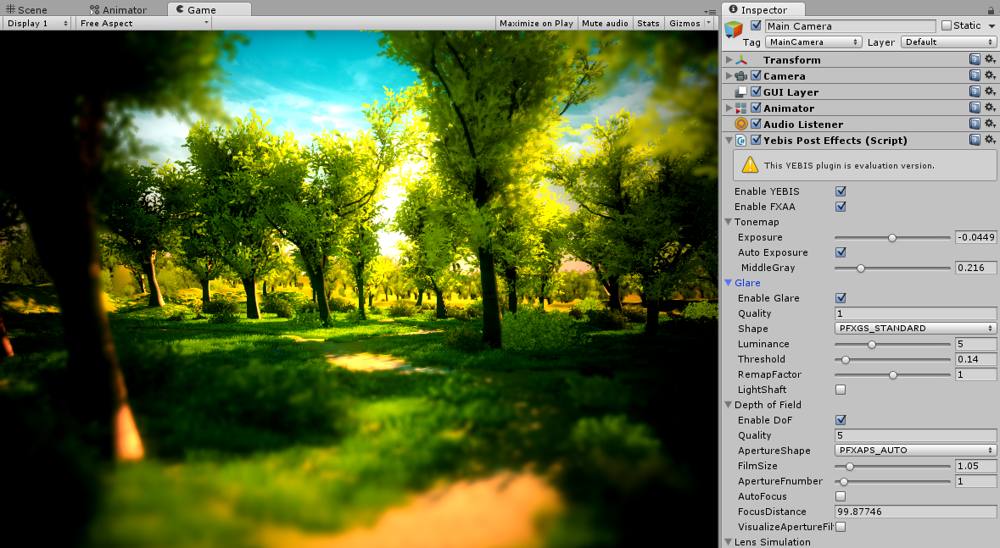

# YEBIS

**YEBIS a post-effects middleware solution**

Briefly explained, post-effects are visual effects added during post-processing to a frame that has already been fully rendered in order to enrich its visuals. Although not unlike the process of retouching photos taken with a digital camera, post-effects used in real-time graphics employ a special algorithm for retouching, and generating effects in real-time.
YEBIS is middleware that enables such post-effects.

# Plugin Documentation

We are supplying to Maya and Unity Plugin.

- [YEBIS for Unity](Yebis4Unity.md "YEBIS for Unity")  /  [日本語版](Yebis4Unity.ja.md "日本語版")
- YEBIS for Maya (documentation is in progress)

# Packages version

- [YEBIS for Unity (beta) Free Trial Version](https://siliconstudio.github.io/YebisForUnityBeta/) 0.6.2

# Help Support YEBIS plugins

  
If you would like to help support us, you can use [GitHub issues](https://github.com/SiliconStudio/YEBIS-plugins/issues)!

# Roadmap/Milestones

Comming soon.

# Release information

- The latest release information:  
[https://github.com/SiliconStudio/YEBIS-plugins/releases](https://github.com/SiliconStudio/YEBIS-plugins/releases)

-----

 

 
(c)Silicon Studio Corp., all rights reserved.

