# YEBIS for Unity Document

- [YEBIS for Unity Document](#yebis-for-unity-document)
- [概要](#abstruct)
- [YEBISプラグインの適用](#YEBIS_apply)
    - [Componentの追加](#YEBIS_apply_component)
    - [Graphics APIの設定](#YEBIS_apply_graphics)
        - [Windows版でのGraphics APIの設定](#YEBIS_apply_graphics_win)
        - [MaxOSX版でのGraphics APIの設定](#YEBIS_apply_graphics_osx)
        - [Android,iOS版でのGraphics APIの設定](#YEBIS_apply_graphics_mobile)
- [YEBISプラグインのパラメータ設定](#YEBIS_setting)
	- [YEBISプラグインの機能全般の設定](#YEBIS_setting_general)
	- [トーンマップの設定](#YEBIS_setting_Tonemap)
	- [グレアの設定](#YEBIS_setting_Tonemap)
	- [被写界深度の設定](#YEBIS_setting_DoF)
	- [レンズシミュレーションの設定](#YEBIS_setting_LensSim)
	- [モーションブラーの設定](#YEBIS_setting_MotionBlur)
	- [SSAO（Screen Space Ambient Occlusion）の設定](#YEBIS_setting_SSAO)
	- [色調変換の設定](#YEBIS_setting_ColorCorrection)
	- [フィードバックエフェクトの設定](#YEBIS_setting_FeedbackEffect)
	- [色収差エフェクトの設定](#YEBIS_setting_ChromaticAberration)
	- [イメージセンサーノイズの設定](#YEBIS_setting_ImageSensorNoise)

# <a name="abstruct"> 概要 </a>
|YEBIS適用前|YEBIS適用後|
|---|---|
||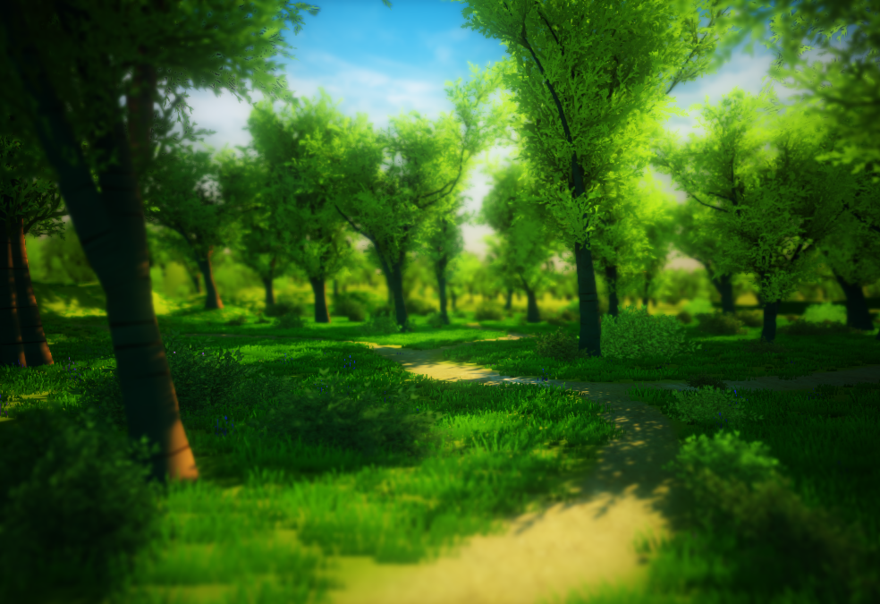|

YEBIS for Unityは、ポストエフェクトライブラリ「YEBIS」を利用したUnity用のプラグインです。  
Unityでレンダリングしたシーンに「YEBIS」のポストエフェクトをかけることができます。

> 「YEBIS」の光の効果やピンボケ等の高品質な画像処理エフェクトをポストエフェクトと呼びます。

# <a name="YEBIS_apply">YEBISプラグインの適用 </a>
## <a name="YEBIS_apply_component">Componentの追加</a>
1. プロジェクトにYEBIS.unitypackageをインポート  
"Assets" > "Import Package" > "Custom Package..." > "YEBIS.unitypackage"  

1. HierarchyよりMainCameraを選択
1. Yebisプラグインを追加  
"Component" > "YEBIS" > "YebisPostEffects"  
[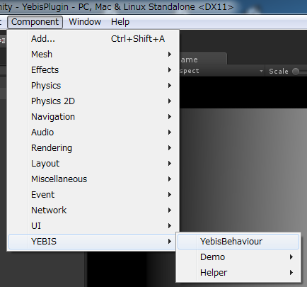](figure/applyYEBIS_add2.png)
1. InspectorからYebisPostEffectsのチェックボックスをONにする

## <a name="YEBIS_apply_graphics">Graphics APIの設定</a>
YEBIS for Unity 評価版では利用可能なGraphics APIは以下の通りです。
- DirectX11 (Windows 64bit)
- OpenGLCore (Windows/MacOSX 64bit)
- OpenGLES3 (Android/iOS)
- OpenGLES2 (Android/iOS)

### <a name="YEBIS_apply_graphics_win">Windows版でのGraphics APIの設定</a>
Windows版ではGraphics APIとしてDirectX11とOpenGLCoreが利用できます。  
UnityのWindowsのデフォルトのGraphics APIはDirectX11であるため、特に問題が無ければ設定の必要なくYEBISを利用できます。  
Windows版でOpenGLCoreを利用する場合の設定は以下の通りです。
#### Windows版でOpenGLCoreを利用する場合の設定
1. Player Settingsを開く  
"Edit" > "Project Settings" > "Player"
1. "Auto Graphics API for Windows"のチェックボックスを外す  
"Settings for PC, Mac & Linux Standalone" > "Auto Graphics API for Windows"
1. ”＋”を押して”OpenGLCore”を選択し,ドラッグをしてGraphics API上部に配置  
[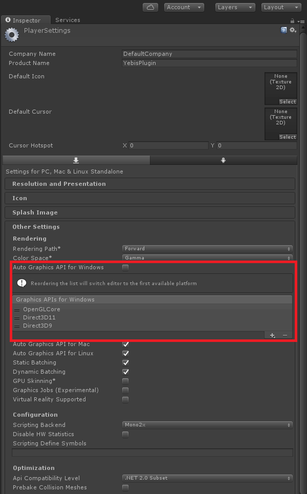](figure/applyYEBIS_GLCore.png)

### <a name="YEBIS_apply_graphics_osx">MaxOSX版でのGraphics APIの設定</a>
1. Player Settingsを開く  
"Edit" > "Project Settings" > "Player"
1. "Auto Graphics API for Mac"のチェックボックスを外す  
"Settings for PC, Mac & Linux Standalone" > "Auto Graphics API for Mac"
1. ”＋”を押して”OpenGLCore”を選択し,ドラッグをしてGraphics API上部に配置  

### <a name="YEBIS_apply_graphics_mobile">Android,iOS版でのGraphics APIの設定</a>
1. Player Settingsを開く  
"Edit" > "Project Settings" > "Player"
1. "Auto Graphics APIs"のチェックボックスを外す  
"Settings for Android" or "Settings for iOS" > "Auto Graphics API"
1. "＋"を押して"OpenGLES3",もしくは"OpenGLES2"を選択し,ドラッグをしてGraphics API上部に配置  

> OpenGLES2を利用した場合,一部ポストエフェクトが制限されています。  

## HDRレンダリング
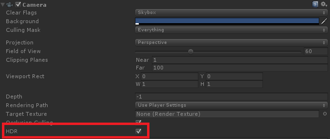
- UnityのMain CameraのHDRが有効化されていると,YEBIS内部のポストエフェクトもHDRモードとなり,クォリティが向上します。
- OpenGLES2ではYEBIS内部のHDRモードは無効化されます。
	- OpenGLES3でも16bit浮動小数点テクスチャに未対応のデバイスの場合はYEBISのHDRモードは無効化されます。
- **HDRモードとLDRモードではポストエフェクトの値(例:グレアの明るさ)の表現が異なるものとなります。**  
そのため,利用するデバイスに合わせてMain CameraのHDRを有効化してからYEBISのパラメータを設定してください。
- HDRモードの使えるデバイスであるならば,Main CameraのHDRモードをONにしてください。
- MainCameraのHDRを有効にするためには,Unityのアンチエイリアス設定をOFFにする必要があります。  
"Edit" > "Project Settings" > "Quality" > "Anti Aliasing"

# <a name="YEBIS_setting"> YEBISプラグインのパラメータ設定

## <a name="YEBIS_setting_general"> YEBISプラグインの機能全般の設定</a>

### YEBISプラグインのポストエフェクトの有効化
- 「YEBISの有効化（Enable YEBIS）」をチェックしてYEBISプラグインのポストエフェクトを有効化します。

### フルスクリーンアンチエイリアスの有効化
- 「FXAAの有効化（Enable FXAA）」をチェックしてフルスクリーンアンチエイリアスを有効化します。

## <a name="YEBIS_setting_Tonemap"> トーンマップの設定</a>
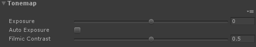
### 露出値の設定
- 「自動露出調整（Auto Exposure）」のチェックをはずします。
- 「露出値（Exposure）」の値を変更して、露出値を直接設定できます

### 自動露出調整の有効化
- シーンのレンダリング画像の明るさを自動調節することができます。
- 「自動露出調整（Auto Exposure）」をチェックして自動露出調整を有効化します。
- 「自動露出の明るさ（Middle Gray）」の値を変更して、自動露出調整の目標とする画面の明るさを設定できます。
- **GLES2では無効**

### 感光シミュレーションの設定
- 感光シミュレーションの特性曲線を設定します。
- 「コントラスト（Filmic Contrast）」の値を変更して、全体的なコントラストを設定します。  高い値を指定するほど、黒潰れや白飛びが発生しやすくなります。
- LDRモードでは感光シミュレーションのパラメータは無効となります。
- **GLES2では無効**

## <a name="YEBIS_setting_Glare"> グレアの設定</a>

### グレアの有効化
- 「グレアの有効化（Enable Glare）」をチェックしてグレアを有効化します。
- 「品質（Quality）」の値を高くするほど品質の高いグレア表現が可能になります

### グレアの形状の変更
- 「形状（Shape）」からプリセットされたグレア形状を選択します。

|                       タイプ | グレア形状                                                                         |
| --------------------------- | ---------------------------------------------------------------------------------- |
| BLOOM                       | ブルームのみ                                                                       |
| LENSFLARE                   | ブルーム,ゴースト（レンズフレア）,残像を含んだタイプ _**GLES2では無効**_       |
| STANDARD                    | 基本的な要素を全てバランス良く含んだタイプ                                         |
| CHEAPLENS                   | くっきりしたゴーストを含む、安価なレンズの表現               |
| AFTERIMAGE                  | 非常に残像の強いタイプ _**GLES2では無効**_                 |
| FILTER_CROSSSCREEN          | クロススクリーンフィルタ. 十字型の光芒発生器を装着したレンズ                       |
| FILTER_CROSSSCREEN_SPECTRAL | 分散の強いクロススクリーンフィルタ. 分散の強い十字型の光芒発生器を装着したレンズ   |
| FILTER_SNOWCROSS            | スノークロスフィルタ. 六方向の光条発生器を装着したレンズ _**GLES2では無効**_   |
| FILTER_SNOWCROSS_SPECTRAL   | 分散の強いスノークロスフィルタ. 分散の強い六方向の光条発生器を装着したレンズ _**GLES2では無効**_  |
| FILTER_SUNNYCROSS           | サニークロスフィルタ. 八方向の光条発生器を装着したレンズ _**GLES2では無効**_   |
| FILTER_SUNNYCROSS_SPECTRAL  | 分散の強いサニークロスフィルタ. 分散の強い八方向の光条発生器を装着したレンズ _**GLES2では無効**_  |
| HORIZONTALSTREAK            | 水平フレア. 水平方向に強い光条を持つタイプ. アナモルフィックレンズの簡易表現       |
| VERTICALSTREAK              | 垂直フレア. 垂直方向に強い光条を持つタイプ. CCDカメラのスミア表現                  |

### グレアの明るさの変更
- 「輝度（Luminance）」の値を変更して、グレア全体の輝度を設定することができます。

### グレアの発生源の制御
- 「高輝度抽出の閾値（Threshold）」で指定した値よりも明るいピクセルのみ抽出され、グレアを発生します。
- **GLES2では無効**

### グレアの効果の強調
- 「非線形マッピング（RemapFactor）」の値を変更して、グレアの輝度成分を非線形に伸張（または圧縮）マッピングすることができます。
- 自然な輝度の計算ではありませんが、見た目の効果を強調することができます。
- **GLES2では無効**

### ライトシャフトの有効化
- 「グレアの有効化（Enable Glare）」と「ライトシャフトの有効化（Light Shaft）」をチェックしてライトシャフト（ゴッドレイとも呼ばれます）を有効化します。
- **GLES2では無効**

### ライトシャフトの光源位置の制御
- 「ライトシャフトの位置(Position)」で光源にしたいオブジェクトのTransformを選択します。
- 接続したオブジェクトのスクリーン上の位置を光源とするライトシャフトが表示されます。
- **GLES2では無効**

### ライトシャフトの効果の制御
- 以下のパラメータでライトシャフトの見た目を調整することができます。
    - 光源の色（Color）
    - 光芒の強さ（Scale）
    - 光芒の長さ（Length）
    - 角度減衰率（Angle Attenuation）
    - 乱数マスクの強さ（Noise Mask）
    - 乱数マスクの細かさ（Noise Frequency）
    - 回折リングの強さ（Diffraction Ring）
    - 回折リングの角度（Diffraction Ring Radius）
- **GLES2では無効**

## <a name="YEBIS_setting_DoF"> 被写界深度の設定</a>

### 被写界深度エフェクト（ピンボケ）の有効化
- 「被写界深度エフェクト（Enable Dof）」をチェックして被写界深度効果を有効化します。
- 「品質（Quality）」の値を高くするほど品質の高いボケ表現が可能になります。
- デバイスによって品質の上限値は異なります。  
PCプラットフォームならば13まで,モバイルならば10までの品質を利用できます。

#### ボケ味シミュレーション
「品質（Quality）」の値が11以上の時,ボケ味シミュレーションを利用することができます。
- 「絞り羽根枚数(Bokeh Blades)」の値を変更して、絞りを構成する羽根の枚数を設定します。
- 「円形絞りの度合(Bokeh Circularity)」の値を変更して、ボケの円形度合いを設定します。
- 「レンズのタイプ（Bokeh Averration）」を指定してボケ味のタイプを設定します。
- 「収差の強さ[Bokeh Longitudinal Aberration]」の値を変更して、前ボケ後ボケの特徴の強さを設定します。
- 「ピンボケに対する口径食（Optical Vignetting）」をチェックして口径食のシミュレーションを有効化します。  レモンボケ、キャッツアイエフェクト等とも呼ばれます。
*（後述のレンズシミュレーションがSimulationモードのときのみ有効となります）*

### ボケ具合の制御
- 「フィルムサイズ（Film Size）」の値を変更して感光素子（フィルム、デジタルカメラのイメージセンサに相当）の縦サイズを設定します。
- 「フィルムサイズ（Film Size）」の値はシーンの作業単位で設定します。
    - Unityでは物理係数やモデルデータのデフォルト設定の作業単位として一般に1メートルが利用されます。
    - Unityの作業単位（スケール）はユーザーが自由に設定できますので、作業中のシーンの縮尺に合わせて換算した値を設定します。
    - 例えば35mmフィルムの縦サイズである24mmを設定する場合、シーンの作業単位がcmであれば2.4(cm)を設定します。
- 「絞りのＦナンバー（Aperture F-number）」の値を変更して絞りのＦナンバーを設定します。

### フォーカスモード
- 「フォーカスモード（Focus Mode）」からフォーカスのタイプを選択します。

|              タイプ  | フォーカスモード            |
| ------------------- | ----------------------- |
| Manual              | 手動設定モード            |
| AutoFocus           | オートフォーカスモード       |
| ObjectFocus 　      | オブジェクトフォーカスモード   |
- Manualモードでは手動で「フォーカス距離（Focus Distance）」の値を直接設定します。
- AutoFocusモードでは「オートフォーカスの測距点(Auto Focus Position)」で指定された画面上の位置に対してオートフォーカスを行います。  
**GLES2では無効**
- ObjectFocusモードでは、指定した「オブジェクト(Focus Object)」までの距離を計算してフォーカス距離に利用します。

## <a name="YEBIS_setting_LensSim"> レンズシミュレーションの設定</a>

- **GLES2では無効**  

### レンズディストーションの有効化
- 「歪曲収差（Lens Distortion）」をチェックしてレンズディストーションを有効化します。

### アナモルフィックレンズ効果の有効化
- 「アナモルフィックレンズ（Anamorphic Lens）」をチェックしてアナモルフィックレンズの効果を有効化します。
- 画面の歪みやグレアの形状など、アナモルフィックレンズ特有の効果が有効になります。

### 周辺部の光量低下現象の設定
- 「周辺減光エフェクト（Vignette Mode）」から周辺減光エフェクトのタイプを選択します。

|              タイプ   | 周辺減光エフェクト                    |
| ------------------- | ---------------------------------- |
| Off                 | 周辺減光エフェクトなし                  |
| Effect              | 擬似的な周辺減光エフェクト              |
| Simulation          | 周辺減光の光学的なシミュレーション       |

### 擬似的な周辺減光エフェクトの設定
- 「周辺減光エフェクト（Vignette Mode）」を「VIGNETTE_EFFECT」に設定します。
- 「光量低下の強度（Vignette Intensity）」の値を変更して、画面中央から離れるほど露出が落ちる周辺光量低下エフェクトの強さを設定します。

### 周辺減光の光学的なシミュレーションの設定
- 「周辺減光エフェクト（Vignette Mode）」を「VIGNETTE_SIMULATION」に設定します。
- 「コサインn乗（Power of Cosine）」の値を変更して、コサイン4乗則による減光シミュレーションを設定します。一般的なレンズでは0.5～1.0の値を設定します。
- 「イメージサークル（Image Circle）」の値を変更して、画像が明るく映る範囲のおおよその直径を設定します。画面の高さを1.0とした比率で設定します。
    - （より正確な説明）口径食を原因とする周辺減光により、輝度が半分まで落ちる円の直径を設定します。
- 「半影の広さ（Penumbra Width）」の値を変更して、イメージサークルで明るい領域と暗い領域の境界にできる半影部分の帯の広さを設定します。1.0を設定すると半影部分は画面の中央まで届く幅になります。
- 周辺減光の光学的なシミュレーションを行うとき,周辺減光の強度は被写界深度の設定である
「Film Size」「Aperture Fnumber」「Focus Distance」などのパラメータによって光量低下の表現が影響を受けます。

## <a name="YEBIS_setting_ColorCorrection"> 色調変換の設定</a>
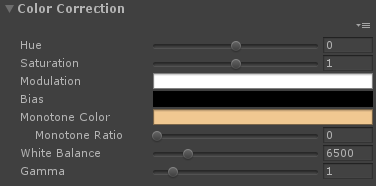
### 色相の設定
- 「色相（Hue）」の値を変更して色相変換を設定します。

### 彩度の設定
- 「彩度（Saturation）」の値を変更して彩度変換を設定します。

### コントラストの設定
- 「コントラスト（Contrast）」の値を変更してコントラスト変換を設定します。

### 明度の設定
- 「明度（Brightness）」の値を変更して明度変換を設定します。

### セピア調の効果
- 「セピア調変換（Sepia）」の値を変更してセピア調変換のかかり方の強さを設定します。

### 色温度の設定
- 「色温度（Temperature）」の値を変更して色温度をケルビン度で設定します。

### ホワイトバランスの設定
- 「ホワイトバランス（White Balance）」の値を変更してホワイトバランスの補正目標の色温度をケルビン度で設定します。

### ガンマ補正の設定
- 「ガンマ補正（Gamma）」の値を変更してガンマ補正を設定します。
- **GLES2では無効**

## <a name="YEBIS_setting_MotionBlur"> モーションブラーの設定</a>
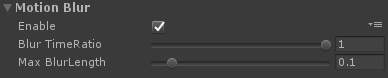
- **GLES2では無効**  

### モーションブラーの有効化
- 「モーションブラーの有効化（Enable Motion Blur）」をチェックしてモーションブラーを有効化します。
- Unity5.4以降のバージョンではオブジェクトが動く場合,カメラが動く場合のモーションブラーを表現できますが、
Unity5.3以前のバージョンではカメラが動く場合のモーションブラーのみ表現できます。

### モーションブラーのシャッター角度の設定
- 「時間比（Blur Time Ratio）」の値を変更して、1フレームあたりのシャッター開放時間の比率を設定します。1.0を設定すると、シャッター角度360度に相当するモーションブラーが発生します。

### モーションブラーの長さの調節
- 「最大の長さ（Max Blur Length）」の値を変更して、モーションブラーの最大の長さを制限することができます。画面の高さを1.0とした比率で設定します。

## <a name="YEBIS_setting_SSAO"> SSAO（Screen Space Ambient Occlusion）の設定</a>
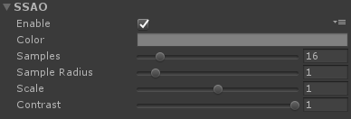
- **GLES2では無効**

### SSAOの有効化
- 「SSAOの有効化（Enable SSAO）」をチェックしてSSAOを有効化します。

### SSAOの効果の設定
- 「色（Color）」の値を変更して、SSAOの色を設定します。
- 「サンプル数（Samples）」の値を変更して、SSAOのサンプル数を設定します。値を大きくするとSSAOの品質は高くなります。16～25程度の値が高速で無難な結果になります。
- 「サンプル半径（Sample Radius）」の値を変更して、SSAOのサンプルの物理半径を設定します。
    - 「サンプル半径（Sample Radius）」の値はシーンの作業単位で設定します。
    - 大きな値を設定するほど広い範囲を解析しますが、サンプリングはその分まばらになるため正確な判定が難しくなります。
- 「強さ（Scale）」の値を変更して、SSAOのかかり方の強さを設定します。0.0を指定するとSSAOは無効になります。
- 「コントラスト（Contrast）」の値を変更して、SSAOのかかり方のコントラストを設定します。0.0を指定するとSSAOは無効になります。

## <a name="YEBIS_setting_FeedbackEffect"> フィードバックエフェクトの設定</a>
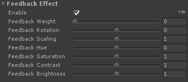
- フィードバック画像（前フレームまでの残像）を利用したエフェクトを設定することができます。
- **GLES2では無効**

### フィードバックエフェクトの有効化
- 「フィードバックエフェクトの有効化（Enable Feedback Effect）」をチェックしてフィードバックエフェクトを有効化します。

### フィードバックエフェクトの強さの設定
- 「強さ（Feedback Weight）」の値を変更して、フィードバック画像の重みを設定します。

### フィードバックエフェクトの回転の設定
- 「回転（Feedback Rotation）」の値を変更して、フィードバック画像の回転を設定します。

### フィードバックエフェクトのスケーリングの設定
- 「スケーリング（Feedback Scaling）」の値を変更して、フィードバック画像のスケーリングを設定します。

### フィードバックエフェクトの色相の設定
- 「色相（Feedback Hue）」の値を変更して、フィードバック画像の色相変換を設定します。

### フィードバックエフェクトの彩度の設定
- 「彩度（Feedback Saturation）」の値を変更して、フィードバック画像の彩度変換を設定します。

### フィードバックエフェクトのコントラストの設定
- 「コントラスト（Feedback Contrast）」の値を変更して、フィードバック画像のコントラスト変換を設定します。

### フィードバックエフェクトの明度の設定
- 「明度（Feedback Brightness）」の値を変更して、フィードバック画像の明度変換を設定します。

## <a name="YEBIS_setting_ChromaticAberration">色収差エフェクトの設定</a>
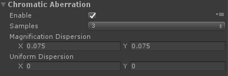
- 色収差エフェクトを設定することでレンズの屈折による色ずれ表現を与えることができます。
- **GLES2では無効**

### 色収差エフェクトの有効化
- 「色収差エフェクトの有効化（Enable Chromatic Aberration）」をチェックして色収差エフェクトを有効化します。

### 色収差エフェクトを制御するパラメタの設定
- 「波長のサンプル数（Samples）」を設定して、色収差を表現するためのサンプリングする波長の数を指定します。
- 「倍率色収差の分散の強さ(Magnification Dispersion)」の値を変更して、収差の倍率の分散の強さを指定します。
- 「一様な収差の分散の強さ(Uniform Dispersion)」の値を変更して、すべての位置で発生する収差の分散の強さを指定します。

## <a name="YEBIS_setting_ImageSensorNoise">イメージセンサーノイズの設定</a>
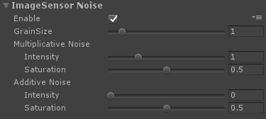
- カメラの撮像素子に生じるノイズによるエフェクトを設定できます。
- **GLES2では無効**

### イメージセンサーノイズの有効化
- 「イメージセンサーノイズの有効化（Enable ImageSensor Noise）」をチェックしてイメージセンサーノイズを有効化します。

### メージセンサーノイズを制御するパラメタの設定
- 「ノイズの大きさ（GrainSize）」を設定して、撮像素子に生じるノイズの大きさを指定します。
- 「乗算ノイズの強度（Multiplicative Noise Intensity）」を設定して、乗算ノイズの強さを指定します。
- 「加算ノイズの強度（Additive Noise Intensity）」を設定して、加算ノイズの強さを指定します。
- 「乗算ノイズの彩度（Multiplicative Noise Saturation）」を設定して、乗算ノイズの彩度を指定します。
- 「加算ノイズの彩度（Additive Noise Saturation）」を設定して、加算ノイズの彩度を指定します。

-----

 
 
(c)Silicon Studio Corp., all rights reserved.

