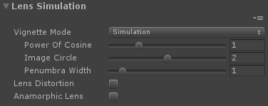

# YEBIS for Unity Document

- YEBIS for Unity Document

WIP

| YEBIS off | YEBIS on |
| --------- | -------- |
|  |  |

_YEBIS for Unity_ is the Unity plugin provides a variety of middleware "YEBIS" real-time post effects to scenes.

> We call image effects of YEBIS post effects

# Apply YEBIS
## Adding Component
1. Import YEBIS.unitypackage  
**Assets** > **Import Package** > **Custom Package...** > **YEBIS.unitypackage**  

1. Select MainCamera from Hierarchy  
1. Add YEBIS Component  
**Component** > **YEBIS** > **YebisPostEffects**  

1. Open Inspactor window and check the box of YebisPostEffects  

## Configure Graphics API
Currently YEBIS for Unity supports some Graphics APIs.
- DirectX11 (Windows 64bit)
- OpenGLCore (Windows/MacOSX 64bit)
- OpenGLES3 (Android/iOS)
- OpenGLES2 (Android/iOS)

### Change Graphics API for Windows
You can use DirectX11 and OpenGLCore as Unity of the Windows version.  
Unity use DirectX11 in Windows version default setting.  
So Graphics APIs setting is not necessary for Windows version YEBIS plugin.
#### Change GLCore API for Windows
If you need to change GLCore API,
1. Open Player Settings  
**Edit** > **Project Settings** > **Player**
1. Uncheck the "Auto Graphics API for Windows"  
**Settings for PC, Mac & Linux Standalone** > **Other Settings** > **Auto Graphics API for Windows**
1. Click "+" and select "OpenGLCore", then drag "OpenGLCore" to the top  

### Change Graphics API for MacOSX
1. Open Player Settings  
**Edit** > **Project Settings** > **Player**
1. Uncheck the "Auto Graphics API for Mac"  
**Settings for PC, Mac & Linux Standalone** > **Other Settings** > **Auto Graphics API for Mac**
1. Click "+" and select "OpenGLCore", then drag "OpenGLCore" to the top  

### Change Graphics API for Android and iOS
1. Open Player Settings  
**Edit** > **Project Settings** > **Player**
1. Uncheck the "Auto Graphics APIs"  
**Settings for Android** or **Settings for iOS** > **Other Settings** > **Auto Graphics API**
1. Click "+" and select "OpenGLES3" or "OpenGLES2", then drag it to the top  

> If you select "OpenGLES2" the post effects are limited due to the difference of APIs.

## HDR rendering

- If you check "HDR" box of Main Camera, post effects of YEBIS are processed in high quality HDR mode.
- If you select OpenGLES2, YEBIS are always processed in non-HDR mode.
  - If you select OpenGLES3 and the runtime device does not support 16bit floating texture format, YEBIS are processed in non-HDR mode.
- **There are differences in the appearance of post effects between HDR and non-HDR (ex. luminance of Glare effect)**

# Parameters of YEBIS

## YEBIS

### Enable YEBIS
- Check **Enable YEBIS**.

### Enable Full Screen Anti-Alias
- Check **Enable FXAA**.

## Tonemap

### Exposure
- Uncheck **Auto Exposure**.
- You can change the scene exposure directly by changing the value of **Exposure**.

### Enable Auto Exposure
- Check **Auto Exposure**.
- You can change the target brightness of Auto Exposure by changing the value of **Middle Gray**.
- Change the value of **Middle Gray**. Middle Gray is the target brightness.
- **GLES2 is not supported**

## Glare

### Enable Glare
- Check **Enable Glare**.
- Specifying higher values increases glare quality.

### Glare Shape
- Set the glare shape from preset types.

|                        Type | Glare Shape                                                             |
| --------------------------- | ----------------------------------------------------------------------- |
| BLOOM                       | Only bloom                                                              |
| LENSFLARE                   | Bloom / ghost(lens flare) / afterimage _**GLES2 is not supported**_ |
| STANDARD                    | The standard type including a good balance of all basic elements        |
| CHEAPLENS                   | Sharp ghosting and other representations of a cheap lens                |
| AFTERIMAGE                  | Very strong afterimage _**GLES2 is not supported**_                 |
| FILTER_CROSSSCREEN          | Cross screen filter. Lens with generator of cross-shaped star filter attached |
| FILTER_CROSSSCREEN_SPECTRAL | Cross screen filter with strong spectrum. Lens with generator of cross-shaped star filter with strong spectrum attached |
| FILTER_SNOWCROSS            | Snow cross filter. Lens with generator of star filter in six directions attached _**GLES2 is not supported**_ |
| FILTER_SNOWCROSS_SPECTRAL   | Snow cross filter with strong spectrum. Lens with generator of star filter with strong spectrum in six directions attached _**GLES2 is not supported**_ |
| FILTER_SUNNYCROSS           | Sunny cross filter. Lens with generator of star filter in eight directions attached _**GLES2 is not supported**_ |
| FILTER_SUNNYCROSS_SPECTRAL  | Sunny cross filter with strong spectrum. Lens with generator of star filter with strong spectrum in eight directions attached _**GLES2 is not supported**_ |
| HORIZONTALSTREAK            | Horizontal flare. This lens flare type produces strong horizontal star streaks. Simple anamorphic lens flare effect |
| VERTICALSTREAK              | Vertical flare. Strong star streaks in the vertical direction. Smears for CCD digital camera, etc |

### Glare Luminance
- You can change the overall brightness of the glare effect by changing the value of **Luminance**.

### Glare Threshold
- **GLES2 is not supported**

### Glare Remap Factor
- **GLES2 is not supported**

### Enable LightShaft
- **GLES2 is not supported**

### LightShaft Position
- **GLES2 is not supported**

### LightShaft Parameters
- **GLES2 is not supported**

## Depth Of Field

### Enable Depth Of Field
- Check **Enable DoF**.
- Specifying higher values increases the depth-of-field effect quality.

### Aperture Shape
- **GLES2 is not supported**

### Bokeh Parameters

### Enable Auto Focus
- **GLES2 is not supported**

### Focus Distance
## Lens Simulation

- **GLES2 is not supported**

### Enable Lens Distortion

### Enable Anamorphic Lens Effect

### Vignetting

### Vignette Effect

### Vignette Simulation

## Color Correction

### Hue

### Saturation

### Contrast

### Brightness

### Sepia

### Color Temperature

### White Balance

### Gamma
- **GLES2 is not supported**

## Motion Blur

- **GLES2 is not supported**

### Enable Motion Blur

### Shutter Angle

### Blur Length

## Screen Space Ambient Occlusion

- **GLES2 is not supported**

### Enable SSAO

### SSAO Parameters

## Feedback Effect

- **GLES2 is not supported**

### Enable Feedback Effect

### Feedback Weight

### Feedback Rotation

### Feedback Scaling

### Feedback Hue

### Feedback Saturation

### Feedback Contrast

### Feedback Brightness

## Chromatic Aberration

- **GLES2 is not supported**

## ImageSensorNoise

- **GLES2 is not supported**

-----

 
 
(c)Silicon Studio Corp., all rights reserved.

