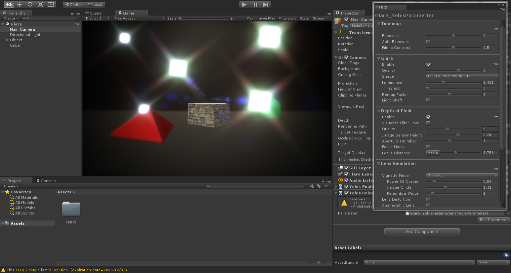
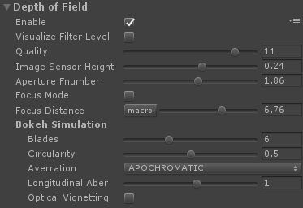

# YEBIS for Unity Document

- YEBIS for Unity Document

WIP

| YEBIS off | YEBIS on |
| --------- | -------- |
|  |  |

_YEBIS for Unity_ is the Unity plugin provides a variety of middleware "YEBIS" real-time post effects to scenes.

> We call image effects of YEBIS post effects

# Apply YEBIS
## Adding Component
1. Import YEBIS.unitypackage  
"Assets" > "Import Package" > "Custom Package..." > "YEBIS.unitypackage"  

1. Select MainCamera from Hierarchy  
1. Add YEBIS Component  
"Component" > "YEBIS" > "YebisPostEffects"  

1. Open Inspactor window and check the box of YebisPostEffects  

## Configure Graphics API
Currently YEBIS for Unity supports some Graphics APIs.
- OpenGL2 (WindowsPC)
- OpenGLES3 (Android/iOS)
- OpenGLES2 (Android/iOS)

### Change Graphics API for Windows
1. Open Player Settings  
"Edit" > "Project Settings" > "Player"
1. Uncheck the "Auto Graphics API for Windows"  
"Settings for PC, Mac & Linux Standalone" > "Other Settings" > "Auto Graphics API for Windows"
1. Click "+" and select "OpenGL2", then drag "OpenGL2" to the top  

### Change Graphics API for Android and iOS
1. Open Player Settings  
"Edit" > "Project Settings" > "Player"
1. Uncheck the "Auto Graphics APIs"  
"Settings for Android" or "Settings for iOS" > "Other Settings" > "Auto Graphics API"
1. Click "+" and select "OpenGLES3" or "OpenGLES2", then drag it to the top  

> If you select "OpenGLES2" the post effects are limited due to the difference of APIs.

## HDR rendering

- If you check "HDR" box of Main Camera, post effects of YEBIS are processed in high quality HDR mode.
- If you select OpenGLES2, YEBIS are always processed in non-HDR mode.
  - If you select OpenGLES3 and the runtime device does not support 16bit floating texture format, YEBIS are processed in non-HDR mode.
- There are differences in the appearance of post effects between HDR and non-HDR (ex. luminance of Glare effect)

# Parameters of YEBIS

## YEBIS

### Enable YEBIS
- Check "Enable YEBIS.

### Enable Full Screen Anti-Alias
- Check "Enable FXAA".

## Tonemap

### Exposure
- Uncheck "Auto Exposure".
- You can change the scene exposure directly by changing the value of "Exposure".

### Enable Auto Exposure
- Check "Auto Exposure".
- Change the value of "Middle Gray". Middle Gray is the target brightness.
- **GLES2 is not supported**

## Glare

### Enable Glare

### Glare Shape

### Glare Luminance

### Glare Threshold
- **GLES2 is not supported**

### Glare Remap Factor
- **GLES2 is not supported**

### Enable LightShaft
- **GLES2 is not supported**

### LightShaft Position
- **GLES2 is not supported**

### LightShaft Parameters
- **GLES2 is not supported**

## Depth Of Field

### Enable Depth Of Field

### Aperture Shape
- **GLES2 is not supported**

### Bokeh Parameters

### Enable Auto Focus
- **GLES2 is not supported**

### Focus Distance
## Lens Simulation

- **GLES2 is not supported**

### Enable Lens Distortion

### Enable Anamorphic Lens Effect

### Vignetting

### Vignette Effect

### Vignette Simulation

## Motion Blur

- **GLES2 is not supported**

### Enable Motion Blur

### Shutter Angle

### Blur Length

## Screen Space Ambient Occlusion

- **GLES2 is not supported**

### Enable SSAO

### SSAO Parameters

## Color Correction

### Hue

### Saturation

### Contrast

### Brightness

### Sepia

### Color Temperature

### White Balance

### Gamma
- **GLES2 is not supported**

## Feedback Effect

- **GLES2 is not supported**

### Enable Feedback Effect

### Feedback Weight

### Feedback Rotation

### Feedback Scaling

### Feedback Hue

### Feedback Saturation

### Feedback Contrast

### Feedback Brightness

-----

     

 
(c)Silicon Studio Corp., all rights reserved.

